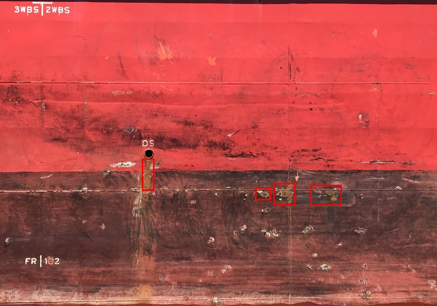
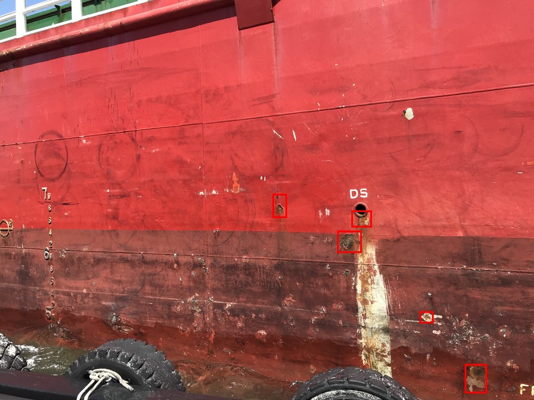
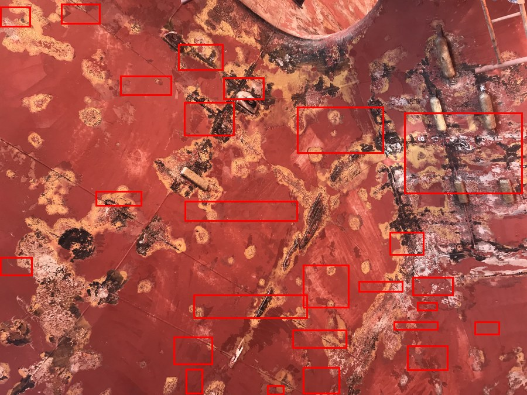
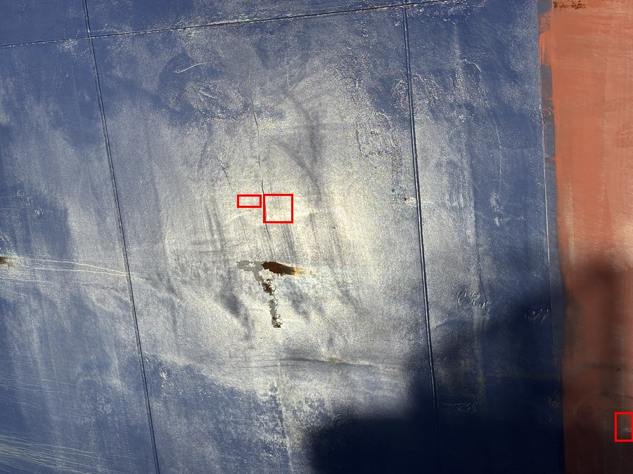
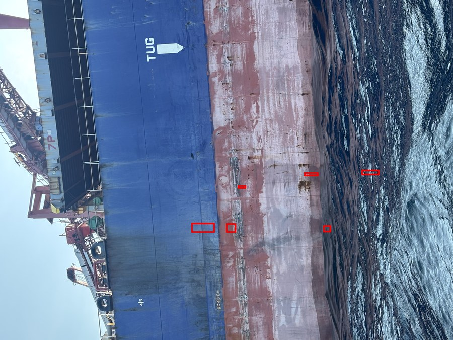

# Ship Hull Corrosion Detection — YOLO11

This repository contains an end-to-end system for detecting corrosion on ship hulls from inspection images. The detection model is based on YOLO11 object detection (upgraded from YOLOv8), and the application also includes a simple OpenCV-based post-processing pipeline to estimate corrosion area, severity, and optional Dice Coefficient when ground-truth masks are available.

The project was developed for research on visual ship hull corrosion inspection, especially for images captured from drones or close-range inspection cameras.

## Sample Dataset Images

Representative ship hull corrosion images from the training dataset. Red boxes show annotated corrosion regions (YOLO bounding boxes).

| | | |
|:---:|:---:|:---:|
|  |  |  |
|  |  | |

---

## Key Ideas

- Detect ship hull corrosion using YOLOv8 bounding boxes.
- Use image tiling to preserve small corrosion details in large or wide ship hull images.
- Add negative/background tiles so the model learns what non-corrosion hull areas look like.
- Compare baseline training with an optimized dataset workflow based on label auditing, background samples, and manual augmentation.
- Provide scripts for training, evaluation, inference, and deployment through a REST API.

## Assumptions

- The dataset has one class: `corrosion`.
- The YOLO model is trained for object detection, not segmentation.
- YOLO labels are bounding boxes in normalized format.
- Ground-truth masks are optional and are only needed if Dice Coefficient is evaluated.
- Area estimation is calculated in pixels by default. If `mm_per_pixel` is provided, the API can also estimate area in `cm2`.
- Severity rules are configurable in `configs/app.yaml`.

## Project Structure

```text
vessel-corrosion/
├── api/                         # REST API (FastAPI)
│   ├── main.py
│   └── static/
├── configs/                     # Dataset YAML configs
│   ├── data.yaml
│   └── data_optimized.yaml
├── data/                        # Raw images and labels (git-ignored)
│   ├── raw/
│   ├── processed/
│   └── yolo/
├── models/                      # Model weights (git-ignored)
├── outputs/                     # Predictions and reports (git-ignored)
├── pipeline/                    # ← Google Colab training & testing package
│   ├── training_colab.ipynb     #   Full Colab workflow notebook
│   ├── requirements.txt         #   Python dependencies
│   ├── configs/
│   │   └── data.yaml            #   Dataset config (absolute Colab path)
│   ├── scripts/
│   │   ├── train.py             #   Training script (YOLO11l + AdamW + tuning)
│   │   └── evaluate.py         #   Evaluation script (mAP, P, R per split)
│   └── src/corrosion/
│       └── yolo_data.py         #   Data path utilities
├── scripts/                     # Local preprocessing scripts
│   ├── tile_yolo_dataset.py     #   Tile large images into 640×640 patches
│   ├── tile_background_yolo_dataset.py
│   ├── split_yolo_dataset.py    #   Group-by-source train/val/test split
│   ├── convert_yolo_seg_to_bbox.py  # Convert segmentation → detection labels
│   └── augment_yolo_train.py
├── src/
│   └── corrosion/
├── docker-compose.yml
├── Dockerfile
└── README.md
```

Dataset files, model weights, training runs, and generated outputs are excluded from Git to keep the repository lightweight.

---

## Pipeline — Google Colab Training & Testing

The `pipeline/` folder is the main package for **training and evaluating the corrosion detection model on Google Colab** with GPU acceleration. All training outputs and model weights are saved directly to Google Drive so they are never lost when a Colab session ends.

### What it contains

| File | Purpose |
|------|---------|
| `training_colab.ipynb` | Complete end-to-end notebook (setup → tune → train → eval → predict) |
| `scripts/train.py` | Training script with YOLO11l, AdamW optimizer, cosine LR, and light augmentation |
| `scripts/evaluate.py` | Evaluation script — reports mAP50, mAP50-95, Precision, Recall per split |
| `configs/data.yaml` | Dataset config pointing to `data/yolo_640/` (absolute Colab path) |
| `requirements.txt` | Pinned dependencies compatible with Colab's torch and CUDA versions |

### Notebook workflow

```
STEP 1  Mount Google Drive
STEP 2  Check GPU (nvidia-smi)
STEP 3  Extract zip and install requirements
STEP 4  Verify dataset (tile counts per split)
STEP 5  Hyperparameter tuning — Random Search (15 trials × 25 epochs)
STEP 6  Full training with best hyperparameters (200 epochs, YOLO11l)
STEP 7  Direct training without tuning (skip STEP 5 & 6 for faster run)
STEP 8  Evaluate on validation set
STEP 9  Evaluate on test set
STEP 10 Display training curves (loss, mAP, P, R)
STEP 11 Sample predictions on test images
```

### Model

| Setting | Value |
|---------|-------|
| Model | YOLO11l (upgraded from YOLOv8l) |
| Input size | 640×640 |
| Optimizer | AdamW |
| Epochs | 200 (with early stopping, patience=50) |
| Augmentation | HSV, rotation ±15°, scale 50%, flip, mosaic, mixup, copy-paste |
| LR schedule | Cosine annealing |

### Dataset

The dataset consists of 640×640 tiles cut from high-resolution ship hull inspection photos. Each source image is kept in a single split (train/val/test) to prevent data leakage between tiles from the same original photo.

| Split | Purpose |
|-------|---------|
| train (70%) | Model training |
| val (15%) | Hyperparameter selection and early stopping |
| test (15%) | Final unbiased evaluation — run once only |

Background (empty) tiles are included (~15% of dataset) to reduce false positives on non-corroded hull areas.

### Output saved to Google Drive

```
My Drive/colab/vessel-corrosion-runs/
├── detect/   ← model weights (best.pt, last.pt) and training plots
├── eval/     ← validation and test evaluation results
├── tune/     ← hyperparameter tuning results (tune_results.yaml)
└── predictions/  ← annotated sample prediction images
```

### How to use

1. Upload `training_colab_upload.zip` to `My Drive/colab/`
2. Open `pipeline/training_colab.ipynb` in Google Colab
3. Select a GPU runtime (T4 or A100)
4. Run cells in order

When adding new data in the future, re-training does not require re-running the hyperparameter tuning step — use the saved `tune_results.yaml` and run STEP 6 directly.

## YOLOv8 Dataset Format

Each image must have a matching `.txt` label file with the same file stem:

```text
data/yolo/images/train/ship_001.jpg
data/yolo/labels/train/ship_001.txt
```

YOLO label format:

```text
<class_id> <x_center> <y_center> <width> <height>
```

All coordinates are normalized from `0` to `1`. Because this project uses one class, corrosion is class `0`:

```text
0 0.5125 0.4380 0.2200 0.1800
```

The default dataset config is:

```text
configs/data.yaml
```

## Local Installation

```bash
python -m venv .venv
source .venv/bin/activate
pip install -r requirements.txt
```

For Windows PowerShell:

```powershell
python -m venv .venv
.\.venv\Scripts\Activate.ps1
pip install -r requirements.txt
```

## Training

Place the dataset in YOLOv8 format, then run:

```bash
python scripts/train.py \
  --data configs/data.yaml \
  --model yolov8m.pt \
  --epochs 100 \
  --imgsz 640 \
  --batch 16
```

Training outputs are saved under:

```text
runs/detect/<run_name>/weights/best.pt
```

## Image Tiling

Ship hull images are often very large or very wide. If the full image is resized directly to `640x640`, small corrosion regions can become too small for the model to learn well. Tiling solves this by cutting the original image into fixed-size patches while keeping local detail.

Example for tiled images and labels:

```bash
python scripts/tile_yolo_dataset.py \
  --images data/raw_new/images \
  --labels data/raw_new/labels \
  --out-images data/processed/images_512 \
  --out-labels data/processed/labels_512
```

The default tiling configuration uses `512x512` tiles, `128` pixels of overlap
(25%), and a minimum bounding-box visibility of `0.50`. If labels are available,
the script remaps every bounding box from the original image coordinates into
the correct tile coordinates. Tiles without a valid label are not saved unless
`--keep-empty` is explicitly provided.

To keep empty tiles as negative/background samples, add:

```bash
--keep-empty
```

Split the generated tiles by source image to prevent tiles from the same
original image appearing in multiple dataset splits:

```bash
python scripts/split_yolo_dataset.py \
  --images data/processed/images_512 \
  --labels data/processed/labels_512 \
  --out-root data/processed/yolo_512 \
  --train 0.80 \
  --test 0.15 \
  --val 0.05 \
  --group-by-source \
  --clear
```

Train the 512-pixel dataset with the conservative runtime augmentation preset:

```bash
python scripts/train.py \
  --data configs/data_512.yaml \
  --model yolov8m.pt \
  --imgsz 512 \
  --light-augment \
  --name ship_corrosion_512_light_aug
```

## Optimized Dataset Workflow

The `data_optimized` experiment was created after early evaluation results showed that precision, recall, and mAP still needed improvement. Instead of immediately using a larger model, the main focus was improving data quality and training signal.

The optimized workflow includes:

- Label auditing in Label Studio to make corrosion bounding boxes more consistent.
- Removing raw images that do not contain corrosion from the positive dataset.
- Re-tiling images into `640x640` patches and remapping YOLO labels correctly.
- Adding around 20% background/negative tiles so the model learns non-corrosion hull regions.
- Splitting the dataset into `80% train`, `15% test`, and `5% val`.
- Applying manual augmentation only to the training split:
  - brightness/contrast adjustment
  - Gaussian blur
  - salt-and-pepper noise
- Disabling Ultralytics auto augmentation during training to avoid double augmentation.

The optimized dataset config is:

```text
configs/data_optimized.yaml
```

If the optimized dataset folder is renamed to `data/yolo` on a server, `configs/data.yaml` can still be used. If the folder remains `data/yolo_optimized`, use `configs/data_optimized.yaml`.

Recommended optimized training command:

```bash
python scripts/train.py \
  --data configs/data_optimized.yaml \
  --model yolov8m.pt \
  --epochs 150 \
  --batch 8 \
  --imgsz 640 \
  --lr0 0.01 \
  --lrf 0.01 \
  --optimizer SGD \
  --patience 40 \
  --device 0 \
  --workers 4 \
  --no-auto-augment \
  --name ship_corrosion_optimized_aug_yolov8m_sgd
```

## Manual Augmentation

Manual augmentation is intended for the training split only. Validation and test data should remain unaugmented to keep evaluation fair.

Example:

```bash
python scripts/augment_yolo_train.py \
  --images data/yolo/images/train \
  --labels data/yolo/labels/train \
  --out-images data/processed/augmented/images/train \
  --out-labels data/processed/augmented/labels/train \
  --fraction 0.5 \
  --brightness-ratio 0.65 \
  --blur-ratio 0.25 \
  --noise-ratio 0.10 \
  --seed 42 \
  --clear
```

The recommended ratio is:

- `65%` brightness/contrast
- `25%` Gaussian blur
- `10%` salt-and-pepper noise

## Evaluation

Evaluate the best checkpoint on the validation split:

```bash
python scripts/evaluate.py \
  --weights runs/detect/ship_corrosion/weights/best.pt \
  --data configs/data.yaml \
  --split val
```

Evaluate on the test split for final reporting:

```bash
python scripts/evaluate.py \
  --weights runs/detect/ship_corrosion/weights/best.pt \
  --data configs/data.yaml \
  --split test
```

The evaluation script reports:

- Precision
- Recall
- mAP50
- mAP75
- mAP50-95

Dice Coefficient can be calculated only when ground-truth masks are available.

## Single Image Inference

```bash
python scripts/infer_image.py \
  --weights runs/detect/ship_corrosion/weights/best.pt \
  --image path/to/image.jpg
```

Outputs:

- JSON analysis result
- Annotated image under `outputs/predictions`

## REST API

Run the API locally:

```bash
uvicorn api.main:app --host 0.0.0.0 --port 8000
```

Open:

```text
http://localhost:8000
```

Default login:

```text
admin / admin123
user / user123
```

The `user` role can upload and analyze images. The `admin` role can also manage users. User data is stored in `data/users.json`, and passwords are stored as PBKDF2 hashes.

Main endpoint:

```text
POST /api/predict
```

Form data:

- `file`: inspection image
- `mm_per_pixel`: optional calibration value, for example `0.5`

## API Response Example

```json
{
  "image": {
    "filename": "ship.jpg",
    "width": 1280,
    "height": 720
  },
  "summary": {
    "detections": 2,
    "total_corrosion_area_px": 18340,
    "total_corrosion_area_cm2": null,
    "corrosion_ratio": 0.0199,
    "severity": "moderate"
  },
  "detections": [
    {
      "id": 1,
      "class_name": "corrosion",
      "confidence": 0.86,
      "bbox_xyxy": [120, 80, 360, 240],
      "bbox_area_px": 38400,
      "corrosion_area_px": 9200,
      "corrosion_area_cm2": null,
      "corrosion_ratio_in_bbox": 0.2396,
      "severity": "moderate",
      "dice_coefficient": null
    }
  ],
  "artifacts": {
    "annotated_image_url": "/outputs/predictions/annotated_xxx.jpg",
    "mask_image_url": "/outputs/predictions/mask_xxx.png"
  }
}
```

## Docker

Build and run:

```bash
docker compose up --build
```

The app will be available at:

```text
http://localhost:8000
```

Use the `./models:/app/models` volume to provide a production model, for example:

```text
models/best.pt
```

## Docker Production

Copy the environment template:

```bash
cp .env.example .env
```

Make sure the model exists:

```text
models/best.pt
```

Run production mode:

```bash
docker compose -f docker-compose.prod.yml up -d --build
```

Check the container:

```bash
docker compose -f docker-compose.prod.yml ps
docker logs -f corrosion-api
```

Open:

```text
http://SERVER_IP:8000
```

Persistent data:

- `data/users.json`: local user database
- `models/best.pt`: YOLOv8 model file
- `outputs/`: uploaded files and prediction outputs

## Deployment to a Linux VPS

1. Prepare an Ubuntu 22.04/24.04 VPS.
2. Install Docker and the Compose plugin.
3. Clone this repository.
4. Upload the best YOLOv8 model to `models/best.pt`.
5. Configure `.env` or environment variables:

```bash
export MODEL_PATH=models/best.pt
export APP_CONFIG=configs/app.yaml
```

6. Start the service:

```bash
docker compose up -d --build
```

7. Add an Nginx reverse proxy:

```nginx
server {
    server_name corrosion.example.com;

    client_max_body_size 25M;

    location / {
        proxy_pass http://127.0.0.1:8000;
        proxy_set_header Host $host;
        proxy_set_header X-Real-IP $remote_addr;
        proxy_set_header X-Forwarded-For $proxy_add_x_forwarded_for;
        proxy_set_header X-Forwarded-Proto $scheme;
    }
}
```

8. Enable HTTPS with Certbot.

## Production Notes

- Store model weights in a volume, not inside the Docker image.
- Use environment variables for model and config paths.
- Limit upload size in both FastAPI and Nginx.
- Validate MIME type and file extension.
- Save prediction outputs with UUID-based filenames.
- Keep training and serving environments separate.
- Run the API behind Nginx with HTTPS.
- Monitor latency, detection count, average confidence, and file size.
- Version model files, for example `models/yolov8_corrosion_v1.pt`.
- For valid physical area estimation, calibrate the camera or drone and provide `mm_per_pixel` or homography information.
- For academically valid Dice Coefficient reporting, prepare manual or semi-manual ground-truth masks. Bounding boxes alone are not enough for segmentation ground truth.
